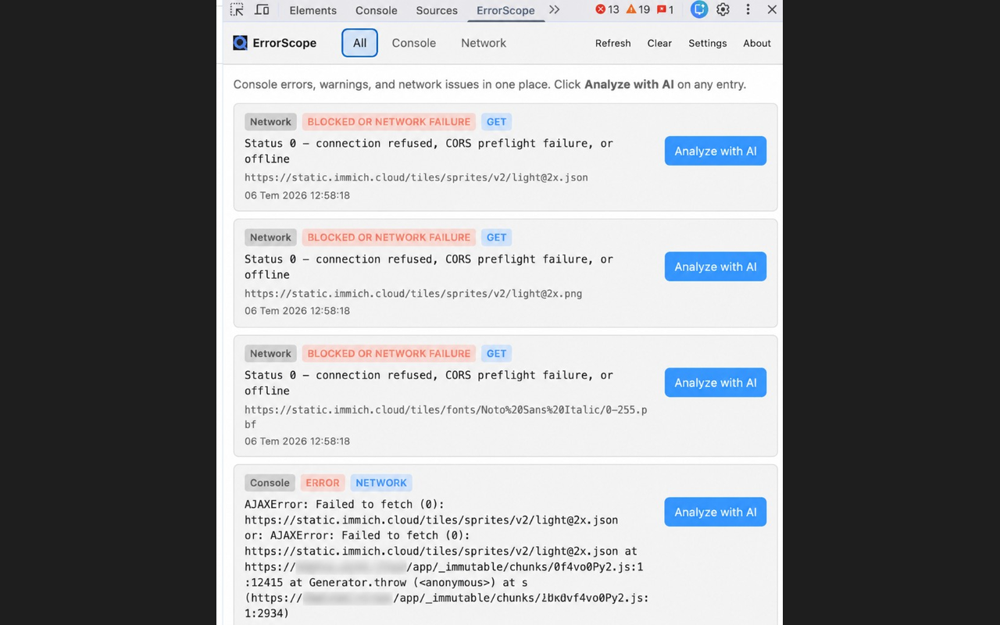
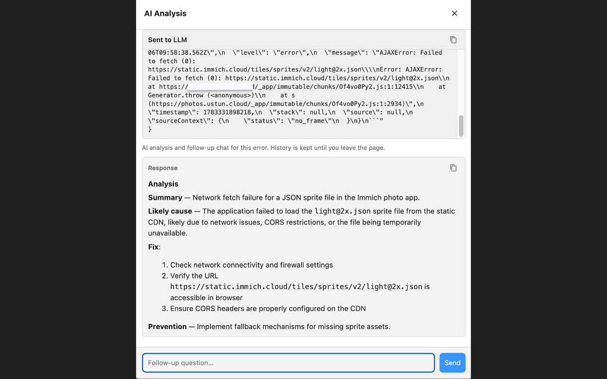
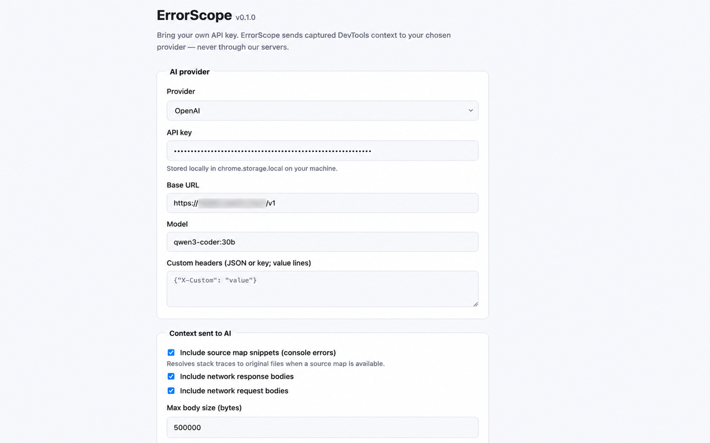

# ErrorScope

[](LICENSE)
[](https://developer.chrome.com/docs/extensions/how-to/devtools/extend-devtools)

An open-source Chrome DevTools extension that adds **Analyze with AI** to your debugging workflow. ErrorScope captures console errors and failed network requests — then explains them using **your own** AI provider.

**Bring your own key.** No vendor lock-in, no telemetry, no backend.

## Features

- **Console panel view** — surfaces `error` and `warn` messages from the inspected page
- **Network panel view** — surfaces failed HTTP requests and blocked connections
- **Analyze with AI** — one-click explanation with fix steps in Markdown
- **Multi-provider** — OpenAI, Anthropic, Gemini, Ollama, or any OpenAI-compatible API
- **Privacy-first** — API keys stay in `chrome.storage.local`; requests go directly to your provider

## Screenshots

### All issues view
Console errors, network failures, and timestamps in one list.



### AI analysis
One-click analysis with follow-up chat. Request payload and response are copyable.



### Settings
Bring your own API key and provider. Context toggles control what is sent to the LLM.



## Installation

### From source (development)

```bash
git clone https://github.com/ustunek/errorscope.git
cd errorscope
```

1. Open Chrome and go to `chrome://extensions`
2. Enable **Developer mode**
3. Click **Load unpacked** and select the `errorscope` folder
4. Open DevTools on any page → select the **ErrorScope** tab

### Chrome Web Store

_Coming soon._

## Configuration

1. Click the ErrorScope toolbar icon or **Settings** in the DevTools panel
2. Choose your provider and enter your API key
3. Adjust base URL / model as needed (defaults are pre-filled per provider)

| Provider | Default base URL | API key required |
|----------|------------------|----------------|
| OpenAI | `https://api.openai.com/v1` | Yes |
| Anthropic | `https://api.anthropic.com/v1` | Yes |
| Gemini | `https://generativelanguage.googleapis.com/v1beta` | Yes |
| Ollama | `http://localhost:11434/v1` | No |
| OpenAI-compatible | Your endpoint | Optional |

### Ollama example

```bash
ollama pull llama3.2
ollama serve
```

In ErrorScope settings: provider **Ollama**, base URL `http://localhost:11434/v1`, model `llama3.2`.

## How it works

```
Inspected page
    │ console.error / fetch failures
    ▼
DevTools (ErrorScope panel)
    │ structured context (error, headers, timing)
    ▼
Service worker ──► Your AI provider API
    │
    ▼
Markdown analysis in-panel
```

Chrome's DevTools API does not allow injecting buttons into the native Console/Network toolbars. ErrorScope adds a dedicated **ErrorScope** DevTools panel that mirrors those signals and exposes **Analyze with AI** on each issue.

## Project structure

```
errorscope/
├── manifest.json
├── icons/
└── src/
    ├── background/      # Service worker (AI API calls)
    ├── devtools/        # DevTools panel UI
    ├── lib/             # Shared logic
    └── options/         # Settings page
```

## Privacy

- API keys are stored locally in your browser
- Captured errors and request metadata are sent **only** to the AI provider you configure
- ErrorScope does not run servers or collect analytics

Review your provider's data handling policy before analyzing production errors that may contain sensitive data.

## Contributing

Contributions are welcome! See [CONTRIBUTING.md](CONTRIBUTING.md).

## License

[MIT](LICENSE) © ErrorScope contributors
